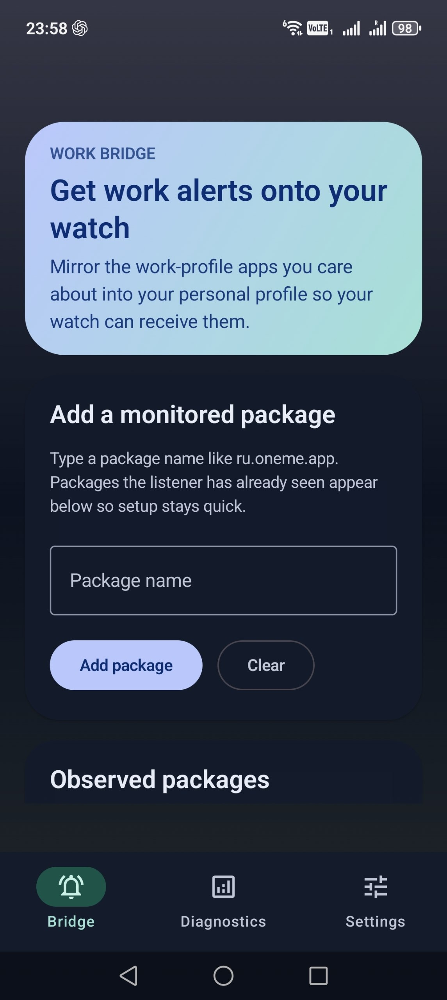

# Work Bridge

Work Bridge forwards selected work-profile notifications into your personal profile so they can reach watches, companion apps, and other notification clients that only listen there.

It is built for Android setups where important work alerts should stay visible on the personal side without giving up tap-through actions, replies, or troubleshooting tools.

<!--suppress CheckImageSize -->


## Why It Exists

On some devices, work-profile notifications do not reliably surface outside the work profile. That can mean missing alerts on a watch, losing quick actions, or having no clear way to tell why forwarding stopped working.

Work Bridge bridges that gap by reposting chosen notifications into the personal profile while keeping the forwarded copy as useful and actionable as possible.

## Features

- forward notifications from selected work-profile apps
- preserve tap-through behavior, delete intents, action buttons, and remote input when the source app supports them
- optionally hide the original work-profile notification after the forwarded copy is posted
- keep built-in diagnostics available so listener, permission, and background issues are easier to understand

## In the App

`Bridge` lets you add monitored packages, review recently observed apps, and manage the forwarding list.

`Diagnostics` shows listener access, app notifications, notification permission, battery optimization state, and recent forwarding activity.

`Settings` controls whether forwarding is enabled and whether the original notification stays visible after cloning.

## Build

Requirements:

- JDK 17
- Android SDK with `compileSdk 36`

If your machine defaults to a newer JDK, point Gradle at JDK 17 before building.

Common commands:

```bash
./gradlew assembleDebug
./gradlew assembleRelease
```

## Compatibility Notes

- current release builds have been tested and are working on:
  - Honor Magic 8 Pro
  - Shelter-managed work profile
  - Xiaomi Watch 5
- forwarding behavior depends on device policy and work-profile behavior
- background reliability can be affected by OEM battery and background restrictions
- notification action fidelity depends on how the source app constructs its notifications

## Releases

APK builds are distributed through GitHub Releases.

## Support

If Work Bridge is useful to you, and you'd like to support its developer, you can send a donation on [DeStream](https://destream.net/live/TornaDoz/donate).
